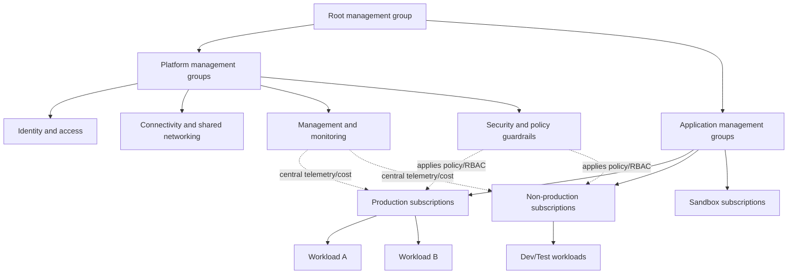
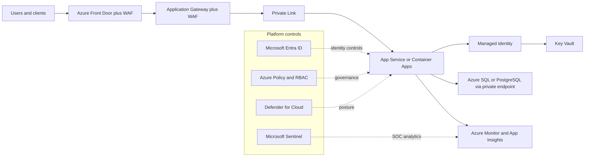
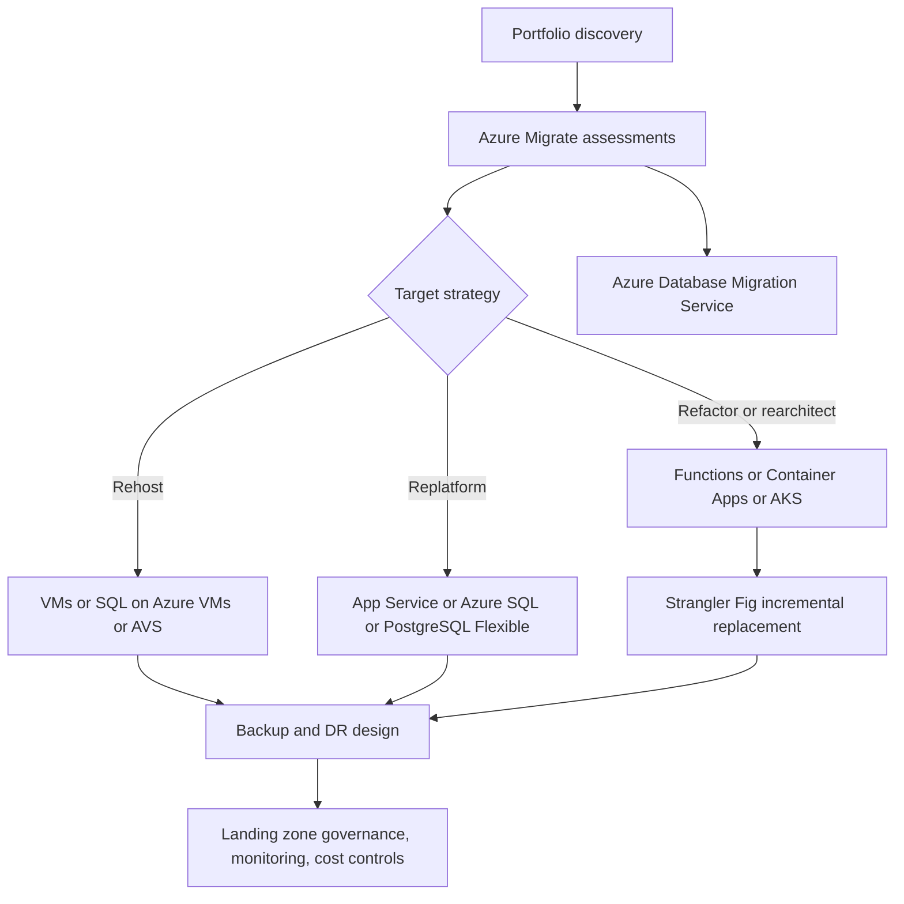

# Deep Research Report on Microsoft Azure Features, Best Practices and Principles

## Executive summary

Azure now spans more than 200 generally available products, so a rigorous Azure strategy is less about memorising every SKU and more about adopting a disciplined decision model: start from the Azure Well-Architected Framework, implement a Cloud Adoption Framework landing zone, then choose the highest-level managed service that still meets non-functional requirements for control, performance, compliance, and portability. Microsoft’s own guidance consistently points architects first to the Well-Architected pillars, Azure landing zones, technology decision guides, and service guides rather than to product-by-product checklists. citeturn29search0turn15search0turn0search1turn21search0

Across Microsoft’s current guidance, the strongest recurring design pattern is: **govern first, automate everything, minimise standing privilege, prefer private connectivity, instrument from day zero, and treat cost as a design variable rather than a billing afterthought.** In practical terms, that means management groups and policy at the top of the estate, subscriptions for isolation, Infrastructure as Code with Bicep or Terraform and Azure Verified Modules, federated CI/CD authentication, managed identities instead of secrets, private endpoints over public ingress when feasible, and Azure Monitor plus Service Health plus Backup/DR configured as part of the initial deployment rather than later. citeturn20search1turn20search4turn14search12turn14search0turn14search2turn4search8turn10search3turn3search4turn17search11turn5search22

For **compute**, Microsoft’s guidance clearly favours managed platforms over infrastructure when requirements allow: App Service for conventional web/API hosting, Functions for event-driven serverless code, Container Apps for serverless containers and jobs, AKS only when Kubernetes control is genuinely required, and VMs or VM scale sets when OS-level control, custom runtimes, or legacy workloads demand it. citeturn11search11turn2search0turn16search6turn2search2turn21search20turn1search8turn16search8

For **data**, Microsoft strongly differentiates between object, file, and block storage, and between managed relational, distributed NoSQL, and open-source relational platforms. Blob Storage is the default durable object store; Azure Files is for shared SMB/NFS semantics; Managed Disks are for VM-attached block storage; Azure SQL Database and Managed Instance are the default managed SQL options; Cosmos DB is for globally distributed low-latency NoSQL/vector use cases; PostgreSQL and MySQL Flexible Server are the preferred managed OSS relational targets. citeturn1search1turn12search1turn12search6turn11search8turn11search0turn11search9turn1search3turn11search2

For **security and governance**, the evidence-backed Azure baseline is mature and opinionated: Microsoft Entra ID as the identity control plane, Conditional Access as the Zero Trust policy engine, Privileged Identity Management for just-in-time elevation, Azure RBAC for resource access, managed identities for workload authentication, Key Vault for key and secret custody, Defender for Cloud for CNAPP/CSPM posture management, Sentinel for SIEM/SOAR, Azure Policy for guardrails, and management groups for hierarchical scope. A critical current caveat is that **Azure Blueprints is being retired**, with Microsoft recommending Deployment Stacks and Template Specs instead. citeturn13search12turn13search0turn4search0turn4search17turn4search8turn13search5turn13search10turn3search0turn20search4turn20search1turn19search2turn14search1

For **operations, cost, and migration**, Microsoft’s recent guidance has become notably more prescriptive. Recommended practice is to use OpenTelemetry-based observability, DCR-governed ingestion, alerts as code, progressive and safe deployments, chaos and load testing for important workloads, budgets plus anomaly alerts plus Advisor, and commitment discounts such as Reservations and Savings Plans where utilisation is predictable. Migration is now framed less as “move VMs” and more as “rationalise the portfolio”: use Azure Migrate for discovery and assessment, Azure Database Migration Service for database moves, modernise only where business value justifies the extra risk, and use Strangler Fig for incremental legacy replacement. Azure Site Recovery is for disaster recovery, not as the primary strategic migration service. citeturn17search0turn22search3turn17search9turn28search5turn28search2turn6search4turn5search17turn27search16turn4search6turn3search3turn18search1turn18search12turn18search2turn18search7

**Assumptions used in this report:** because Azure has 200+ GA offerings and service guides intentionally focus on the architecturally important feature set rather than every SKU, this report covers the major production-relevant Azure service families, principal features, current best practices, and architecturally significant previews/retirements as of **19 July 2026**. Region-specific feature gaps, sovereign cloud differences, preview-only functionality, and very narrow workload services are called out only where they materially affect architectural decisions. citeturn29search0turn21search0

## Platform principles and decision model

Microsoft’s current Azure architecture stack is built around three mutually reinforcing frameworks. The **Azure Well-Architected Framework** provides the five quality pillars: **reliability, security, cost optimisation, operational excellence, and performance efficiency**. The **Cloud Adoption Framework** provides the organisational and platform adoption path. **Azure landing zones** are the recommended target-state architecture for a governed multi-subscription Azure estate. Microsoft explicitly describes the landing zone as the standardised and recommended approach for operating Azure at scale. citeturn15search0turn6search9turn18search3turn0search1turn5search3

The practical meaning of those frameworks is straightforward. The Well-Architected pillars tell you **what “good” looks like**. CAF tells you **how to organise the people, process, and platform work**. Landing zones tell you **where enterprise controls live**: identity, connectivity, management groups, policies, subscriptions, shared services, and platform automation. Microsoft’s design areas explicitly include security, governance, compliance, management, connectivity, resource organisation, business continuity, and platform automation. citeturn0search4turn5search3turn0search19

A useful way to interpret Microsoft’s guidance is that Azure should be designed in **two layers**. The first layer is the **platform foundation**: management-group hierarchy, subscription topology, identity model, hub/spoke or Virtual WAN connectivity, policies, naming/tagging, logging, and cost controls. The second layer is the **application or workload layer**: the specific compute, data, messaging, AI, and operational design for each workload. This layered view is central to Azure landing zones and prevents teams from re-solving governance and security for every project. citeturn20search1turn20search9turn5search19turn0search1

Microsoft also increasingly treats **sustainability** as an outcome of sound architecture rather than a separate pillar. The guidance explicitly says sustainability strongly overlaps with Cost Optimisation: right-sizing, autoscaling, and eliminating idle capacity reduce both spend and unnecessary energy use. For cloud architects, the implication is that the same anti-waste disciplines that reduce cost usually improve sustainability as well. citeturn15search3turn0search9

The diagram below synthesises Microsoft’s recommended enterprise Azure operating model: a governed platform foundation, then workload subscriptions deployed on top.



That structure reflects Microsoft’s guidance on management groups, resource organisation, landing zones, and subscription design. citeturn20search1turn20search3turn20search9turn5search3

## Core Azure service families

The table below consolidates the major Azure service families the user requested. It emphasises **what the service family is for, which features matter most architecturally, what Microsoft recommends, and where the caveats are**.

| Service family | Concise description and key features | Evidence-backed recommendations | Caveats and limitations | Primary Microsoft sources |
|---|---|---|---|---|
| **Compute** | Azure compute spans **VMs and VM Scale Sets** for full infrastructure control, **App Service** for managed web/API hosting, **Functions** for event-driven serverless code, **Container Apps** for serverless containers and jobs, **AKS** for managed Kubernetes, and **ACI** for simple container execution without orchestration. Microsoft’s own compute decision tree is the correct starting point for host selection. | Prefer the **highest-level managed runtime** that satisfies the workload. Use **App Service** for standard web apps and APIs, **Functions Flex Consumption** for new serverless/event-driven apps, **Container Apps** for microservices and background jobs where you want scale-to-zero and KEDA/Dapr without operating Kubernetes, **AKS** only when you need Kubernetes API/control plane semantics, and **VMs/VMSS** for legacy, specialised, or OS-bound workloads. Use VM Scale Sets and availability zones for VM fleets. | VMs and AKS carry materially more operational responsibility than App Service, Functions, or Container Apps. App Service optimises for HTTP workloads and platform conventions, not arbitrary infrastructure control. ACI is intentionally lightweight and does not replace a full orchestrator. Functions plan behaviour differs by hosting plan and OS. | citeturn11search11turn16search8turn16search0turn2search0turn16search6turn2search2turn21search20turn1search8turn16search7 |
| **Storage** | Azure Storage’s main choices are **Blob Storage** for object data, **Azure Files** for managed SMB/NFS shares, and **Managed Disks** for VM-attached block storage. Core capabilities include redundancy options, lifecycle tiering, versioning, soft delete, immutability, private endpoints, and flexible IO performance for newer disk types such as Premium SSD v2. | Default to **Blob Storage** for application object data and static content. Use **Azure Files** only when shared file-system semantics are required. Use **Managed Disks** for VM OS/data disks. Turn on **private access controls**, soft delete/versioning, and immutability where recovery or compliance matters. Prefer **private endpoints** and Azure AD/RBAC-style authentication where supported rather than account-key-centric designs. Match redundancy explicitly to RPO/RTO requirements. | NFS for Azure Files requires the premium file shares model, and a single file share cannot be accessed by both SMB and NFS. Premium SSD v2 and Ultra Disks have region and feature restrictions, and neither is usable as an OS disk. Storage security controls protect the account, not necessarily every data-loss scenario inside it. | citeturn1search1turn12search1turn12search6turn1search9turn12search0turn12search7turn12search11turn10search22turn12search10 |
| **Networking** | Azure networking includes **Virtual Network**, **Load Balancer**, **Application Gateway**, **Front Door**, **Private Link/private endpoints**, **Azure Firewall**, **DDoS Protection**, **VPN Gateway**, **ExpressRoute**, **Virtual WAN**, and **Bastion**. These services cover east-west network design, internet ingress, private PaaS access, hybrid connectivity, and secure admin access. | Use **private endpoints/Private Link** in preference to service endpoints when feasible, because Microsoft now explicitly recommends private endpoints as the more secure private-access pattern. For internet-facing web workloads, combine **WAF** and DDoS-aware architecture, often with **Front Door** or **Application Gateway** depending on global vs regional needs. Use **Bastion** rather than exposing VM admin ports publicly. Use **Virtual WAN** when network scale or tunnel count exceeds what simpler VPN-centric patterns handle well. | Not every service/region supports every resiliency or private networking feature. Standard vs Basic SKUs matter operationally; Basic Load Balancer is retired. Some hybrid networking choices are constrained by throughput, topology, or tunnel-count limits. Front Door Private Link requires Premium. | citeturn1search2turn10search7turn10search11turn10search3turn10search0turn10search15turn1search18turn10search6turn10search2turn10search16turn10search1turn10search5turn22search1 |
| **Databases and search** | Azure’s mainstream data platforms are **Azure SQL Database**, **Azure SQL Managed Instance**, **SQL Server on Azure VM**, **Azure Cosmos DB**, **Azure Database for PostgreSQL Flexible Server**, **Azure Database for MySQL Flexible Server**, and increasingly **Azure AI Search** for retrieval and grounding. Key differentiators are compatibility, scale semantics, consistency, global distribution, and operational burden. | Prefer **managed PaaS data services** over VMs unless deep engine or OS-level control is explicitly required. Use **Azure SQL Database** for most greenfield SQL workloads; **Managed Instance** when SQL Server compatibility and instance-level features matter; **Cosmos DB** when you need globally distributed, low-latency NoSQL/vector workloads; **PostgreSQL/MySQL Flexible Server** for managed OSS relational workloads; and **Azure AI Search** when GenAI/RAG needs a governed retrieval layer. | Strong consistency in Cosmos DB can increase write latency across distant regions. SQL MI trades autonomy for higher compatibility but has different service limits from SQL Database. PostgreSQL scaling and storage operations can involve restart or other operational nuances. Azure AI Search and Foundry-related features can vary by region and pricing model. | citeturn11search8turn21search10turn11search3turn11search9turn11search1turn11search5turn1search3turn31search0turn11search2turn9search0turn9search9turn9search12 |
| **Identity and access** | Azure’s control plane identity model centres on **Microsoft Entra ID**, **Conditional Access**, **Azure RBAC**, **managed identities**, and **Privileged Identity Management**. This is the security spine for users, service principals, workload identities, and privilege elevation. | Build around **Zero Trust identity controls**: Conditional Access, MFA, device or context-aware access, **least privilege**, and **just-in-time** elevation via PIM. Use **managed identities** for workloads to remove credential management from code and pipelines. Keep Azure RBAC and Entra role assignments tightly scoped, and separate human admin identities from workload identities. | Capability depth varies by licence tier and product boundary. Entra roles and Azure RBAC roles solve different scope problems; they should not be conflated. Privileged access without process controls still creates operational risk even when PIM is enabled. | citeturn13search12turn13search0turn4search17turn4search8turn4search0turn4search12 |
| **Security** | The core Azure security stack is **Key Vault/Managed HSM**, **Defender for Cloud**, **Sentinel**, **Microsoft cloud security benchmark guidance**, DDoS protection, firewalling, and confidential computing capabilities including attestation. | Use **Key Vault** for keys, secrets, and certificates; **Defender for Cloud** for posture and workload protection; **Sentinel** for SIEM/SOAR where a SOC exists; and benchmark controls from the **Microsoft cloud security benchmark** as the baseline. Restrict public network access, prefer private paths, and protect sensitive workloads with **confidential computing** or enclave-enabled services where “data in use” protection is a requirement. | Defender and Sentinel value depends heavily on connector scope, deployment maturity, and cost management. Some richer posture/risk features depend on specific plans. Confidential computing improves isolation, but support is workload- and service-specific and can increase cost or reduce feature availability. | citeturn13search5turn13search10turn13search2turn3search0turn13search3turn0search2turn0search11turn23search2turn23search22turn23search18 |
| **Monitoring and management** | **Azure Monitor** is the unified observability service for logs, metrics, traces, and events; **Application Insights** provides application telemetry; **Log Analytics** stores and queries logs; **Service Health** and **Resource Health** expose platform/resource health; **Advisor** provides best-practice recommendations. | Instrument applications with **OpenTelemetry** where possible, centralise logs in **Log Analytics**, define **diagnostic settings** and **alerts/action groups** as code, and use **Service Health** plus **Resource Health** alongside workload telemetry. Use DCRs and transformations to shape ingestion and cost, and use Advisor continuously rather than only during reviews. | Monitor cost can become materially high without sampling, filtering, and retention discipline. Diagnostic settings are per-resource. Some legacy ingestion approaches are being superseded by DCR-based patterns. Health signals do not replace workload-level SLOs and synthetic checks. | citeturn3search4turn17search4turn17search0turn22search15turn17search5turn17search9turn17search1turn6search18turn6search2turn5search17 |
| **AI and machine learning** | Azure’s current AI platform has shifted toward **Microsoft Foundry** as the unified Azure PaaS for enterprise AI operations, model builders, and AI application development. **Azure Machine Learning** remains the core ML lifecycle service. Supporting services include **Foundry Models/Azure OpenAI**, **Azure AI Search**, and **Document Intelligence**. | Use **Microsoft Foundry** for governed GenAI/agent app development, **Azure Machine Learning** for classical ML and MLOps, and **Azure AI Search** for grounding/RAG. Always review **data privacy** and **Responsible AI** documentation for model use. Prefer retrieval architectures that ground outputs in enterprise data rather than relying on base-model prompting alone. | Model availability varies by region and cloud. Some legacy feature paths are being replaced; Microsoft now identifies the **Foundry Agents service** as the supported replacement for “Azure OpenAI on your data”. Responsible AI constraints, limited-access terms, and privacy posture must be reviewed per service and model. | citeturn9search16turn3search5turn3search9turn3search1turn9search1turn9search0turn9search6turn9search2turn9search7turn9search10turn3search13 |
| **DevOps, IaC, and platform engineering** | Azure delivery tooling spans **Azure DevOps**, **GitHub Actions**, **Bicep**, ARM templates, **Azure Verified Modules**, **Deployment Stacks**, and **Azure Deployment Environments**. Microsoft’s modern guidance is increasingly “policy and infrastructure as code first”. | Use **Bicep** or Terraform with **Azure Verified Modules** for repeatable deployments. Prefer **OIDC/federated credentials** for GitHub-to-Azure authentication instead of long-lived secrets. Use environment approvals/checks for production promotion, and use **Deployment Stacks** where lifecycle management and deny-assignment enforcement matter. | **Azure Blueprints is retiring** and should not be a net-new strategic choice. Deployment Stacks have known limitations and should be evaluated in platform engineering tests before broad rollout. IaC alone is insufficient without policy, identity, and review gates. | citeturn14search12turn14search5turn14search0turn14search2turn14search6turn14search18turn14search1turn28search17turn19search2turn14search9 |
| **Migration, BCDR, governance, cost, compliance** | Azure provides **Azure Migrate** for discovery/assessment/migration orchestration, **Azure Database Migration Service** for database moves, **Azure Backup** and **Site Recovery** for protection, **management groups** and **Policy** for governance, **Cost Management**, **Reservations**, and **Savings Plans** for spend control, and compliance tooling via Policy Regulatory Compliance and Purview Compliance Manager. | Treat migration as **portfolio rationalisation**, not just a tooling exercise. Use Azure Migrate for discovery and sizing, DMS for data moves, landing zones before cutover, and Backup/DR from the first production deployment. Put budgets, anomaly alerts, and commitment discounts in place early. For compliance, combine Azure Policy’s regulatory views with wider programme tooling such as Purview Compliance Manager and service-specific data residency reviews. | Site Recovery is for **disaster recovery only**, not the main strategic migration platform. Policy regulatory dashboards provide only a **partial** view of total compliance posture. Commitments such as Reservations and Savings Plans only pay off when demand is sufficiently predictable. | citeturn3search3turn18search1turn18search7turn5search22turn5search2turn20search1turn20search4turn6search4turn27search16turn4search6turn23search3turn23search0turn23search23 |

A representative secure Azure application pattern, aligned with Microsoft’s landing zone and baseline web architecture guidance, looks like this:



This pattern is consistent with Microsoft’s network-secured baseline architectures, Private Link guidance, identity controls, and security posture tooling. citeturn21search15turn10search3turn10search8turn13search0turn4search8turn13search10turn3search0

## Security governance and compliance

The most important Azure governance lesson is that **scope matters**. Microsoft distinguishes clearly between **management groups**, **subscriptions**, **resource groups**, and **resources**, and recommends using each for a different design concern. Management groups provide the top-level hierarchy for RBAC and Policy across subscriptions. Subscriptions provide isolation for workload boundaries, billing, quotas, and policy inheritance. Resource groups manage lifecycle for closely related resources. Tags provide metadata and cost allocation, but they do not replace scoping decisions. citeturn20search1turn20search9turn20search13turn5search4turn20search5

For **Azure Policy**, Microsoft’s current guidance is notably safety-oriented. Policy enforces organisational standards and gives an aggregated compliance dashboard, but Microsoft explicitly recommends starting with **audit** or **auditIfNotExists** before moving to stronger effects such as **deny**, **modify**, or **deployIfNotExists**. For effects that remediate or deploy resources, assignments require a **managed identity**. Microsoft also now documents explicit **safe deployment practices for Policy assignments**, including validating impact on a subset of scope before broad enforcement. citeturn23search11turn20search4turn20search2turn20search12turn20search16turn28search9

For **identity security**, the Microsoft-recommended baseline is mature and consistent: use Entra as the identity control plane, Conditional Access as the policy engine, and Privileged Identity Management to reduce standing admin rights. In simple terms, Azure’s security posture is strongest when **people sign in with strong conditional controls, workloads authenticate without embedded secrets, and privileged access is time-bound and auditable**. Managed identities are especially important because Microsoft explicitly positions them as the way to eliminate application credential management. citeturn13search12turn13search0turn4search0turn4search8turn4search12

For **network security**, Microsoft’s modern recommendation is unambiguous: where possible, consume Azure PaaS services via **Private Link/private endpoints** rather than via public endpoints or older service-endpoint-centric patterns. For public web ingress, the standard pattern is layered defence using WAF and Azure-native DDoS protections, with Application Gateway or Front Door chosen according to regional versus global routing needs. For administrative access to VMs, Bastion is the preferred pattern because it removes the need to expose RDP/SSH to the public internet. citeturn10search3turn10search11turn10search7turn10search0turn10search15turn10search2turn22search1

For **data protection**, the Azure baseline is defence in depth: encryption at rest and in transit, privileged access controls, backup recoverability, and optionally confidential computing for “data in use”. Azure Key Vault stores keys, secrets, and certificates; Azure Backup can now be strengthened with soft delete and immutable vault states; Blob Storage offers versioning, soft delete, and WORM immutability; and confidential computing extends protection into attested trusted execution environments, which is valuable for high-assurance processing of sensitive workloads. citeturn13search5turn13search17turn17search10turn17search22turn12search0turn12search7turn23search2turn23search22

For **posture management and SOC operations**, Microsoft’s recommended split is: **Defender for Cloud** to understand what is misconfigured or exposed, and **Sentinel** to correlate and respond to security events. Defender adds risk-based prioritisation, but Microsoft notes that some richer prioritisation views depend on enabling specific plans such as Defender CSPM. Sentinel best practices now explicitly focus on selecting the right connectors, filtering and optimising ingestion, and improving KQL efficiency, which is important because SIEM value and SIEM cost rise together if feeds are not curated. citeturn13search10turn13search2turn13search6turn3search0turn13search3turn13search11

For **compliance**, Microsoft offers several complementary layers, and architects should not confuse them. **Azure Policy Regulatory Compliance** maps controls and responsibilities to technical assessments inside Azure. **Defender for Cloud’s Regulatory Compliance dashboard** operationalises some of that view. **Purview Compliance Manager** provides broader compliance assessment and multicloud programme tracking. A critical caveat from Microsoft’s own documentation is that Azure Policy gives only a **partial** view of overall compliance; legal, procedural, and organisational evidence still sits outside policy evaluation. Data residency also depends on geographic and regional choices; Microsoft describes Azure geographies as residency boundaries and provides service-specific residency guidance such as the EU Data Boundary documentation. citeturn23search3turn23search7turn23search0turn23search12turn23search23turn23search21turn23search5

## Operations cost optimisation and migration

Microsoft’s 2025–2026 operations guidance strongly favours **observable, testable, progressively delivered systems** over “deploy and monitor later”. Azure Monitor is positioned as the unified observability platform for cloud and hybrid environments, bringing together metrics, logs, traces, and events. Application Insights now aligns closely with **OpenTelemetry**, and Azure Monitor’s DCR model is the modern route for shaping collection, transformations, and ingestion. In practice, the architecturally correct move is to treat telemetry schema, routing, retention, and alert topology as part of the workload design, not as an ops afterthought. citeturn3search4turn17search4turn17search0turn22search3turn22search15

For **operational alerting**, Microsoft’s pattern is to standardise on alert rules plus **action groups** and to combine internal telemetry with platform health channels. Action groups can trigger notifications and automated responses; Service Health provides service-impacting communications for the services and regions in use; Resource Health explains the health of individual resources. This means Azure-native monitoring should normally have at least three classes of signals: workload SLO/SLA signals, resource signals, and platform or regional health signals. citeturn17search9turn17search1turn17search11turn17search3

For **reliability operations**, Microsoft is increasingly explicit about **safe deployment practices** and **resilience testing**. The guidance recommends minimising blast radius through progressive exposure and rollback-ready release processes. For workloads that matter, Microsoft explicitly recommends integrating **Azure Chaos Studio** and **Azure Load Testing** or equivalent validation into the development cycle, especially for mission-critical estates. That is a strong indicator that Azure architecture is converging toward SRE-style reliability engineering rather than basic infrastructure uptime monitoring. citeturn28search5turn28search2turn28search0turn28search14

For **backup and disaster recovery**, Azure Backup and Site Recovery remain foundational, but Microsoft’s current guidance puts unusually strong emphasis on recoverability controls against accidental or malicious deletion: soft delete, immutable vault states, and governance around the vault itself. Site Recovery remains the primary Azure DR orchestration service for many VM/physical replication patterns, but Microsoft’s own FAQ is clear that it should be understood as a **DR service**, not as the main strategic migration framework. citeturn5search22turn17search2turn17search10turn17search22turn5search2turn18search7

For **cost optimisation**, the evidence-backed Azure playbook has several layers:

- Use **Cost Management** for cost analysis, budgets, anomaly alerts, scheduled exports, and accountability reporting. Microsoft explicitly documents budget alerts and anomaly detection as core controls. citeturn6search4turn6search8turn6search12turn6search20
- Use **Advisor** continuously to identify idle or underutilised resources and cost opportunities, not just during annual reviews. citeturn5search1turn5search17
- Apply **Reservations** for predictable steady-state usage and **Savings Plans** for broadly predictable compute spend. Microsoft states potential list-price savings of up to **72%** for Reservations and up to **65%** for Savings Plans versus pay-as-you-go. citeturn4search2turn4search6turn4search14turn27search16
- Use **elastic and serverless pricing models where the workload truly is elastic**: Azure SQL serverless for intermittent single databases, Functions Flex Consumption for event-driven code, Container Apps Consumption for serverless containers, and Cosmos DB serverless where very bursty low-duty-cycle usage fits. citeturn31search9turn16search6turn30search5turn26search13turn27search3
- Optimise service-specific cost levers: Blob access tiers and lifecycle management, PostgreSQL reserved capacity and right-sizing, MySQL stop/start for time-bounded environments, Monitor sampling and DCR transformations, and appropriate file share billing models for Azure Files. citeturn26search2turn31search8turn11search2turn17search20turn22search11turn27search4

The migration model Microsoft recommends is no longer purely “lift-and-shift first”. CAF now explicitly separates **migrate**, **modernise**, and **cloud-native** tracks, and Microsoft’s application modernisation guidance uses the “6 Rs” rationalisation language. The architecturally sound sequence is: discover, assess, rationalise, choose the target state, then only modernise during migration where the business case outweighs schedule and execution risk. citeturn18search0turn18search3turn18search12turn18search18turn18search15

A synthesis of Microsoft’s migration path looks like this:



This flow reflects Azure Migrate, DMS, CAF migration planning, and the Strangler Fig pattern from the Azure Architecture Center. citeturn3search3turn18search1turn18search6turn18search12turn18search2

## Service comparisons and recent releases

The tables below compare the most common Azure alternatives architects routinely choose between.

### Compute hosting alternatives

| Service | Typical use-cases | Scalability model | Pricing model | Pros | Cons | Sources |
|---|---|---|---|---|---|---|
| **Azure Virtual Machines / VM Scale Sets** | Legacy apps, custom runtimes, OS-level agents, specialised networking, tightly coupled third-party software. | Manual or autoscaled VM instances; VMSS supports load-balanced fleets and zonal patterns. | Pay for VM instances, attached disks, networking, and related resources. | Maximum control; broad compatibility; easiest rehost path. | Highest patching/ops burden; weaker platform abstraction; easier to mis-size. | citeturn16search8turn16search0turn16search4turn29search10 |
| **Azure App Service** | Standard web apps, APIs, line-of-business HTTP services, quick PaaS web hosting. | Scale up/down plan tiers and scale out instances; all apps in a plan scale together. | Charged per App Service plan tier and scaled-out instance count; plan-level billing. | Managed PaaS, deployment slots, mature web tooling, lower ops overhead. | Less infra control; shared plan capacity across apps unless isolated; non-HTTP/background-heavy patterns can be awkward. | citeturn2search0turn30search0turn30search2turn21search4 |
| **Azure Functions** | Event-driven code, scheduled jobs, lightweight APIs, message processing, workflow components. | Event-driven horizontal scale; Flex Consumption is the recommended new serverless plan. | Flex Consumption bills on executions, memory, and always-ready instances; Premium bills on core-seconds and memory; Dedicated follows App Service pricing. | Serverless, minimal ops, strong trigger ecosystem. | Cold starts and execution/runtime constraints depend on plan; not ideal for all long-running stateful workloads without specific patterns. | citeturn2search1turn16search6turn30search5turn2search8 |
| **Azure Container Apps** | Microservices, APIs, background jobs, event-driven containers, Dapr/KEDA-based patterns, serverless containers. | Scale-to-zero and autoscaling by HTTP/events/jobs; dedicated workload profiles if needed. | Consumption or Dedicated plan depending on environment/workload profile. | Good balance between container flexibility and low ops; supports jobs and microservices well. | Less control than AKS; some advanced scenarios still need Kubernetes. | citeturn2search2turn2search3turn26search4turn26search13 |
| **Azure Kubernetes Service** | Platform-standard Kubernetes, operators, service mesh, complex scheduling, portability requirements, large container estates. | Kubernetes-native scaling across node pools and workloads. | Control plane is Azure-managed; cluster pricing tiers exist; you pay mainly for nodes and associated resources. | Full Kubernetes ecosystem and control. | Highest platform-team skill requirement; cluster security and lifecycle must be actively managed. | citeturn1search8turn26search6turn26search0turn15search7 |
| **Azure Container Instances** | Burst containers, build/data-processing jobs, simple short-lived workloads without orchestration. | On-demand container groups. | Pay for containerised compute resources used. | Fastest simple container execution path. | No full orchestration; narrower fit than Container Apps or AKS. | citeturn16search7turn16search3 |

### Storage alternatives

| Service | Typical use-cases | Scalability model | Pricing model | Pros | Cons | Sources |
|---|---|---|---|---|---|---|
| **Azure Blob Storage** | Object data, backups, media, data lake-style content, static web assets, archive. | Massively scalable object storage with redundancy and tiering options. | Based on stored data, redundancy choice, access tier, and operations. | Default object store, lifecycle-friendly, supports immutability and replication. | Not a shared POSIX/SMB file system; retrieval and operation costs vary by tier. | citeturn1search1turn26search2turn12search0turn12search4 |
| **Azure Files** | Shared file systems, lift-and-shift file shares, SMB/NFS app dependencies, persistent shared volumes. | Managed file shares; premium and standard models; scale depends on billing/performance tier. | Provisioned v2, pay-as-you-go, or legacy provisioned v1 depending on share model. | Native SMB/NFS semantics; can replace many file server patterns. | More expensive than Blob for pure object/archive use; protocol and model choices matter; one share cannot be both SMB and NFS. | citeturn12search1turn12search5turn27search4turn27search20 |
| **Managed Disks** | VM OS disks and data disks, database storage on IaaS, latency-sensitive block storage. | Scales per disk type/size/performance tier; Premium SSD v2 and Ultra separate capacity from IOPS/throughput more cleanly. | Charged by provisioned disk characteristics; newer disk types include configurable performance billing. | Best fit for VM-attached persistent block storage; strong performance options. | Not a general shared application store; VM size can bottleneck realised disk performance; some premium disk types have restrictions. | citeturn12search6turn12search2turn27search1turn27search17 |

### Database alternatives

| Service | Typical use-cases | Scalability model | Pricing model | Pros | Cons | Sources |
|---|---|---|---|---|---|---|
| **Azure SQL Database** | New managed SQL apps, SaaS databases, OLTP workloads, most greenfield relational SQL. | Scale compute/storage independently in vCore model; serverless available for single DBs. | vCore provisioned or serverless; DTU also still exists. | Fully managed, built-in HA/backups, low ops overhead. | Less instance-level compatibility than Managed Instance or SQL on VM. | citeturn11search8turn27search2turn31search9turn21search1 |
| **Azure SQL Managed Instance** | SQL Server compatibility, migration of instance-level features, near-full managed SQL Server estate. | Managed instance scaling within service limits. | vCore-based model. | Strong compatibility with SQL Server while still managed. | More constrained/expensive than SQL Database for simple workloads; different limits and networking model. | citeturn11search0turn21search10turn31search5turn11search3 |
| **SQL Server on Azure VM** | Full SQL Server control, unsupported edge cases, OS/db engine customisation. | VM-based scale patterns. | VM plus SQL licensing model. | Maximum compatibility and admin control. | Highest operational burden of the SQL options. | citeturn11search3turn31search19 |
| **Azure Cosmos DB** | Globally distributed low-latency NoSQL, high-scale apps, flexible schema, vector-aware modern app patterns. | Instant scale with provisioned throughput, autoscale, or serverless depending mode; multi-region replication. | Provisioned RU/s or serverless RU consumption. | Global distribution, rich SLAs, predictable latency model. | Poor fit for highly relational OLTP patterns; consistency choices can affect latency/cost. | citeturn11search9turn27search3turn11search1turn31search18 |
| **Azure Database for PostgreSQL Flexible Server** | Managed PostgreSQL for app modernisation, OSS relational, extension-friendly workloads. | Scale by pricing tier, vCores, storage, HA options, and replicas. | Based on provisioned compute/memory/storage tier; replicas billed separately. | Managed Postgres with flexible configuration and cloud-native options. | Some scale/storage operations require restart or have limitations; architects must plan around those. | citeturn1search3turn31search0turn31search10turn31search4 |
| **Azure Database for MySQL Flexible Server** | Managed MySQL workloads, OSS web/apps, hybrid sync and moderate-cost managed relational. | Flexible compute/storage with stop/start and networking choices. | Managed DB pricing by provisioned resources and backup/storage components. | Strong fit for common MySQL application patterns; useful stop/start option for cost control. | Version lifecycle and extended-support timing matter; verify feature fit beyond straightforward app hosting. | citeturn11search2turn31search6turn11search6 |

### Recent major Azure feature releases and platform changes

This timeline is **representative rather than exhaustive** and prioritises releases with architectural significance across the last three years.

| Date | Release or change | Why it matters architecturally | Sources |
|---|---|---|---|
| **September 2023** | **Azure Container Apps jobs** and the **Dedicated plan** reached general availability. | Strengthened Container Apps as a serious serverless-container platform for run-to-completion jobs and mixed cost/performance hosting. | citeturn7search6 |
| **April 2024** | **Enhanced disaster recovery features for Azure Database for PostgreSQL Flexible Server** reached general availability. | Improved Postgres BCDR options and made Flexible Server a stronger production target for managed OSS relational workloads. | citeturn24search2 |
| **May 2024** | **Azure SQL Managed Instance Update Policy** reached general availability. | Gave architects more control over how quickly SQL engine innovations arrive in MI estates, which matters for compatibility and change-risk management. | citeturn8search3turn7search12 |
| **July 2025** | **Azure Virtual Network Manager** reached general availability. | Signalled a stronger native control plane for estate-wide network administration and segmentation at scale. | citeturn25search0turn25search7 |
| **May 2026** | **Azure Monitor dashboards with Grafana** became generally available across public, government, and China clouds. | Strengthened Azure’s observability posture for teams standardising on Grafana-style operational visualisation. | citeturn8search0turn32search2 |
| **May 2026** | **Application Gateway for Containers – Service Mesh integration with Istio** became generally available. | Improved container ingress patterns for Kubernetes/container platforms and strengthened Azure-native traffic management around service mesh. | citeturn32search4 |
| **June 2026** | The **new Microsoft Foundry portal** became generally available, and Microsoft positioned Foundry as the unified Azure PaaS for enterprise AI operations and AI app development. | This is a major control-plane shift for Azure AI architecture and affects how architects frame GenAI, agents, and ML platform decisions. | citeturn7search3turn9search16turn32search3 |
| **July 2026** | **Azure Container Storage v2.1.0 with Elastic SAN integration and on-demand installation** reached general availability. | Improves stateful container storage options for AKS/container estates. | citeturn8search2 |
| **July 2026 onward** | **Azure Blueprints retirement phase began**; retirement is now scheduled for **31 January 2027** with migration to Deployment Stacks and Template Specs recommended. | Not a feature launch, but a critical platform change for governance architecture. Avoid Blueprints for new designs. | citeturn19search2turn19search3 |

## Appendix of key Microsoft documentation

The list below is a curated set of the **primary Microsoft URLs** most relevant to this report. It is intentionally selective rather than exhaustive.

```text
Azure Well-Architected Framework
https://learn.microsoft.com/en-us/azure/well-architected/

Azure landing zones
https://learn.microsoft.com/en-us/azure/cloud-adoption-framework/ready/landing-zone/

Cloud Adoption Framework
https://learn.microsoft.com/en-us/azure/cloud-adoption-framework/

Azure Architecture Center
https://learn.microsoft.com/en-us/azure/architecture/

Choose an Azure compute service
https://learn.microsoft.com/en-us/azure/architecture/guide/technology-choices/compute-decision-tree

Prepare to choose a data store in Azure
https://learn.microsoft.com/en-us/azure/architecture/guide/technology-choices/data-stores-getting-started

Azure networking services overview
https://learn.microsoft.com/en-us/azure/networking/networking-overview

Azure Monitor overview
https://learn.microsoft.com/en-us/azure/azure-monitor/fundamentals/overview

Overview of Azure Policy
https://learn.microsoft.com/en-us/azure/governance/policy/overview

Management groups overview
https://learn.microsoft.com/en-us/azure/governance/management-groups/overview

Microsoft Defender for Cloud overview
https://learn.microsoft.com/en-us/azure/defender-for-cloud/defender-for-cloud-introduction

Microsoft Sentinel overview
https://learn.microsoft.com/en-us/azure/sentinel/overview

Managed identities for Azure resources
https://learn.microsoft.com/en-us/entra/identity/managed-identities-azure-resources/overview

Conditional Access overview
https://learn.microsoft.com/en-us/entra/identity/conditional-access/overview

Azure Key Vault overview
https://learn.microsoft.com/en-us/azure/key-vault/general/overview

Azure Storage introduction
https://learn.microsoft.com/en-us/azure/storage/common/storage-introduction

Azure Blob Storage introduction
https://learn.microsoft.com/en-us/azure/storage/blobs/storage-blobs-introduction

Azure Files introduction
https://learn.microsoft.com/en-us/azure/storage/files/storage-files-introduction

Azure managed disks overview
https://learn.microsoft.com/en-us/azure/virtual-machines/managed-disks-overview

Azure App Service overview
https://learn.microsoft.com/en-us/azure/app-service/overview

Azure Functions overview
https://learn.microsoft.com/en-us/azure/azure-functions/functions-overview

Azure Functions scale and hosting
https://learn.microsoft.com/en-us/azure/azure-functions/functions-scale

Azure Container Apps overview
https://learn.microsoft.com/en-us/azure/container-apps/overview

Azure Kubernetes Service overview
https://learn.microsoft.com/en-us/azure/aks/what-is-aks

Azure SQL Database overview
https://learn.microsoft.com/en-us/azure/azure-sql/database/sql-database-paas-overview

Azure SQL Managed Instance documentation
https://learn.microsoft.com/en-us/azure/azure-sql/managed-instance/

Azure Cosmos DB overview
https://learn.microsoft.com/en-us/azure/cosmos-db/overview

Azure Database for PostgreSQL Flexible Server overview
https://learn.microsoft.com/en-us/azure/postgresql/overview

Azure Database for MySQL Flexible Server overview
https://learn.microsoft.com/en-us/azure/mysql/flexible-server/overview

Azure Migrate overview
https://learn.microsoft.com/en-us/azure/migrate/migrate-services-overview?view=migrate

Azure Database Migration Service overview
https://learn.microsoft.com/en-us/azure/dms/dms-overview

Azure Backup overview
https://learn.microsoft.com/en-us/azure/backup/backup-overview

Azure Site Recovery overview
https://learn.microsoft.com/en-us/azure/site-recovery/site-recovery-overview

Microsoft Foundry overview
https://learn.microsoft.com/en-us/azure/foundry/what-is-foundry

Azure Machine Learning overview
https://learn.microsoft.com/en-us/azure/machine-learning/overview-what-is-azure-machine-learning?view=azureml-api-2

Azure AI Search overview
https://learn.microsoft.com/en-us/azure/search/search-what-is-azure-search

Azure Blueprints retirement
https://learn.microsoft.com/en-us/azure/governance/blueprints/blueprint-retirement

Azure deployment stacks
https://learn.microsoft.com/en-us/azure/azure-resource-manager/bicep/deployment-stacks

Azure Verified Modules
https://learn.microsoft.com/en-us/community/content/azure-verified-modules

Cost Management overview
https://learn.microsoft.com/en-us/azure/cost-management-billing/costs/overview-cost-management

Azure Reservations
https://learn.microsoft.com/en-us/azure/cost-management-billing/reservations/save-compute-costs-reservations

Azure savings plans
https://learn.microsoft.com/en-us/azure/cost-management-billing/savings-plan/savings-plan-overview

Azure compliance documentation
https://learn.microsoft.com/en-us/azure/compliance/

Purview Compliance Manager
https://learn.microsoft.com/en-us/purview/compliance-manager

Azure confidential computing overview
https://learn.microsoft.com/en-us/azure/confidential-computing/overview
```