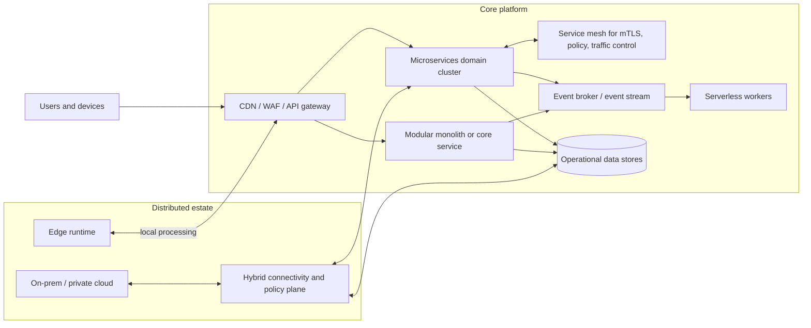

# Cloud Architecture Practices

## Executive summary

Across the major cloud guidance sets, there is now a strong convergence on what “good” cloud architecture looks like. AWS, Azure, and Google Cloud all frame architecture quality around a similar set of pillars: security, reliability, performance efficiency, cost optimisation, operational excellence, and now sustainability. NIST’s cloud and zero-trust publications provide the corresponding vendor-neutral baseline. In plain terms, the common message is that a good cloud architecture is not the fanciest one; it is the one that delivers the required business outcome with the fewest unnecessary moving parts, while remaining secure, observable, resilient, and economically efficient. citeturn0search15turn1search0turn1search2turn7search3turn16search0

The evidence does **not** support a single “best” architecture pattern for every organisation. A modular monolith is often the best default when product scope is still changing and the platform team is small; AWS explicitly notes that monoliths remain valid for limited complexity or where domain boundaries are not yet well established, provided the design stays modular, and Google Cloud similarly recommends modular design regardless of whether the starting point is monolithic or microservices-based. Microservices become compelling when bounded business domains are clear and different parts of the system need independent release cadence, scaling, and ownership. Serverless fits especially well for unpredictable, event-driven, or intermittent workloads because it removes server management and scales automatically, but recent empirical studies continue to find that long-running steady workloads often become cheaper on containers or VMs. citeturn18search5turn18search12turn18search9turn8search8turn9search2turn9search4turn4search0turn4search16

Event-driven design is best treated as a **decoupling pattern** rather than as a religion. It shines where systems need to react asynchronously to state changes, absorb spikes, isolate faults, and improve auditability through event logs or event sourcing. Service mesh is similarly a **cross-cutting platform pattern** rather than a goal in itself: it can centralise mTLS, policy, retries, traffic shaping, and telemetry for large service estates, but empirical work shows that badly chosen or badly tuned mesh deployments can add meaningful latency and CPU overhead. Hybrid and multi-cloud architectures are usually justified by explicit business drivers such as regulation, sovereign placement, phased migration, or resilience requirements. Edge architectures make sense where local latency, local processing, or limited connectivity dominate. citeturn8search0turn8search2turn8search17turn8search3turn14search6turn14search12turn4search1turn7search1turn7search18turn7search2turn4search18

On efficiency, the evidence-backed optimisation hierarchy is fairly consistent. The highest-value wins usually come from removing waste before adding sophistication: right-sizing compute, killing idle resources, using autoscaling properly, setting realistic container requests and limits, choosing serverless for intermittent demand, and introducing spot or preemptible capacity only for workloads that can survive interruption. Kubernetes has become a mainstream control plane for container orchestration, but that does not automatically make it the right first move for every team. The platforms also increasingly align cost and sustainability, with both Azure and Google explicitly linking right-sizing and autoscaling to lower energy consumption and emissions. citeturn6search19turn10search0turn10search5turn10search9turn10search1turn6search0turn6search1turn6search2turn1search16turn1search19turn17search13

Security and compliance implications become more significant as architectures become more distributed. Microservices, containers, and hybrid estates increase the number of trust relationships, identities, secrets, policies, network paths, and software supply-chain dependencies that must be governed. NIST’s current position is clear: modern cloud-native architectures should be designed around workload identity, least privilege, defence in depth, and zero-trust-style continuous verification. Operationally, that means architecture decisions and operating model decisions must be made together; architecture that cannot be continuously built, tested, observed, and governed is not mature enough for production, regardless of pattern. citeturn5search2turn16search0turn16search1turn16search4turn16search17

The source spine for this report is deliberately weighted towards official and primary material: the AWS, Azure, and Google Cloud Well-Architected frameworks; NIST SP 800-190, 800-204A/B/C, 800-207, 800-207A, and 800-233; Kubernetes and OpenTelemetry documentation; Google’s DORA and SRE resources; CNCF surveys and case studies; and recent peer-reviewed or academic benchmark work on serverless, service meshes, autoscaling, and edge trade-offs. citeturn0search15turn1search0turn1search2turn5search2turn16search0turn16search1turn16search4turn16search17turn14search6turn10search0turn10search5turn10search9turn10search15turn12search0turn12search4turn17search10turn4search1turn4search16turn4search18

## Architecture patterns

The key analytical point is that these patterns are **composable**. In practice, strong modern systems rarely choose exactly one of them. A common real-world architecture is a modular monolith or a small number of core microservices behind an API gateway, plus an event backbone, plus serverless workers for asynchronous jobs, plus selective use of service mesh for internal policy enforcement, with hybrid or edge extensions only where there is a clear regulatory or latency reason. That aligns with provider guidance and with case-study evidence from cloud-native adopters. citeturn18search16turn13search8turn15search18turn7search6turn7search10

The diagram below is a provider-neutral synthesis of the dominant patterns and how they tend to combine in practice. It reflects the architecture roles described in the cloud provider frameworks, NIST’s cloud-native and service-mesh publications, and current Kubernetes- and event-driven reference guidance. citeturn7search3turn8search3turn14search6turn8search0turn8search2turn13search19

Microservices are most valuable where the system can be split along clear business boundaries. Azure’s architecture guidance defines them as small autonomous services built around a single business capability and bounded context, which is simply a clear business boundary such as billing, catalogue, or fulfilment. The main advantages are independent deployment, fault isolation, and differentiated scaling; the main costs are more network hops, harder debugging, harder data consistency, and greater operational overhead. Azure and AWS both emphasise that microservices require changes in development model and CI/CD, not just code decomposition. citeturn8search8turn13search8turn8search16turn13search0

That is why a **modular monolith** remains such a strong evidence-backed option, especially for smaller and medium teams. AWS says that even when starting with a monolith, the workload should be segmented modularly so it can evolve later, and also notes that monoliths remain valid where business responsibilities are not yet clearly separable. Google Cloud makes the same basic point by recommending modular design as a general performance and resilience principle even before any microservices split. Recent migration work reinforces this: a 2024 case study found that a modular-monolith step can be an effective intermediate phase, but it also observed that migration effort and performance issues already become visible during modularisation, not only after the final microservices cut-over. citeturn18search5turn18search12turn18search9turn4search15

Serverless is best understood in everyday terms as “managed execution that appears only when work arrives”. AWS, Azure, and Google Cloud all position it as event-driven, automatically scaling, and infrastructure-abstracted. That brings especially strong value for background processing, APIs with variable traffic, integration handlers, scheduled jobs, and automation. The trade-off is that you give the platform more control over lifecycle and resource shape, and must design around statelessness, concurrency limits, event retries, and cold-start behaviour. A recent 2024 benchmark found serverless functions cheaper for lightweight, short-duration operations and highly concurrent spikes, while container-based compute became more affordable for bigger, long-running jobs and showed shorter cold-start latency in that study. Expert interviews reported in 2023 similarly concluded that serverless is highly suitable for unpredictable workloads but can become less cost-effective for some high-scale steady workloads. citeturn9search2turn9search4turn9search17turn4search0turn4search16

Event-driven architecture is often the best “glue” for modern cloud systems. Azure describes it as producers, channels, and consumers; Google describes it as services reacting to changes in state; AWS prescriptive guidance highlights its fit for loose coupling, peak-load handling, CQRS, and event sourcing. In practical terms, event-driven design helps different parts of a system work together without directly calling each other all the time. That improves resilience and scalability, but it also makes operational tracing, idempotency, replay handling, and consistency design more important. Azure’s current guidance explicitly calls out the observability challenge of business flows that span multiple asynchronous components. citeturn8search0turn8search2turn8search5turn8search17turn9search0turn9search12

A service mesh is best thought of as a dedicated networking and policy layer for service-to-service traffic. NIST SP 800-204A, SP 800-204B, and SP 800-233 treat the mesh as the main way to provide consistent runtime services such as secure communication, policy enforcement, load balancing, retries, circuit breaking, and monitoring for microservices without changing each service’s code. Istio’s own documentation frames the same value around identity, transparent TLS, authorisation, audit, traffic management, and observability. The caution is equally evidence-backed: a 2023 academic study measured service-mesh overhead of up to 269% higher latency and 163% more virtual CPU in its benchmark applications, with severity highly dependent on workload and configuration. More recent mesh designs such as ambient or node-centred proxying try to reduce those costs by avoiding per-pod L7 processing unless needed. citeturn8search3turn16search1turn14search6turn14search12turn14search15turn14search17turn4search1turn14search4

Hybrid and multi-cloud patterns should be approached as **strategy-led**, not default. AWS’s hybrid best-practices guidance starts with hybrid-cloud strategy and technical strategy; Google’s current hybrid/multicloud guidance starts from business drivers and pattern selection; Azure Arc positions itself as a management and governance plane for resources that sit across data centres, multiple clouds, and edge. The reasonable inference is that these patterns are justified when they solve a specific problem such as regulatory placement, cloud exit risk, incremental migration, local processing, or resilience across control planes. They are rarely economical or simpler “just in case”. citeturn7search1turn7search18turn7search10turn16search11turn16search7

Edge computing is not simply “smaller cloud”; it is cloud architecture pushed physically closer to where events happen. Google’s edge-hybrid pattern says time- and business-critical workloads stay local while the cloud handles everything else. Recent academic work found that edge setups can deliver significantly lower latency and enhanced privacy, while cloud centralisation still offers better scalability and capacity for more complex computation. The design implication is straightforward: use edge where milliseconds, local autonomy, or local data handling matter enough to justify the added operational complexity. citeturn7search2turn4search18turn4search2

| Pattern | Cost efficiency when well-fitted | Scalability | Complexity | Security and compliance leverage | Ecosystem maturity | Best first use case |
|---|---|---|---|---|---|---|
| Modular monolith | High | Medium | Low | Medium | High | Early product teams, clear single application boundary |
| Microservices | Medium | Very high | High | High | High | Distinct business domains, independent team releases |
| Serverless | High for intermittent demand; lower for steady heavy demand | Very high | Medium | Medium to high | High | Spiky APIs, background jobs, integrations, event handlers |
| Event-driven backbone | Medium to high | High | Medium to high | Medium to high | High | Asynchronous workflows, peak smoothing, audit trails |
| Service mesh | Low to medium | High | High | Very high | Medium to high | Large service estates needing uniform mTLS/policy/traffic control |
| Hybrid or multi-cloud | Low to medium | High | Very high | High for sovereignty and placement; hard to govern consistently | Medium | Regulation, phased migration, portability, distributed operations |
| Edge computing | Medium to low | High locally; limited without cloud coordination | High | High for locality and privacy; higher physical ops burden | Medium | Ultra-low-latency or intermittently connected operations |

The ratings in the table are a provider-neutral analytical synthesis from official guidance, NIST controls guidance, Kubernetes and service-mesh documentation, and recent empirical studies rather than vendor marketing scores. citeturn18search5turn8search8turn9search2turn8search0turn14search6turn7search1turn7search2turn4search1turn4search16turn4search18

Real-world case signals broadly match the pattern analysis. AWS reports that SBS used a serverless, event-driven architecture to reduce time to release changes by 90% and move from monthly to multiple daily releases, while Siemens reports 85% lower infrastructure costs and 90% fewer customer control system alerts on AWS serverless. Google Cloud’s PCCW Global case attributes faster feature delivery to microservices on GKE and describes moving a codebase of more than one million lines to a new region in minutes using a containerised strategy. CNCF case studies show Finleap Connect operating 50+ microservices across ten Kubernetes clusters over GCP, AWS, and private cloud, and Elkjøp adopting Linkerd to gain service-health visibility and encrypt service-to-service communication from the outset. citeturn11search5turn11search1turn11search2turn11search0turn11search8

## Efficiency metrics and optimisation

Efficiency should be measured as a **portfolio of outcomes**, not as one number. The cloud provider frameworks now converge on cost, performance, reliability, operational excellence, and sustainability as simultaneous design concerns, and the FinOps framework makes the same point from the cost side by tying cloud consumption to business value rather than viewing savings in isolation. In practical terms, teams should track at least unit cost, latency and throughput, resource utilisation, error rate, and some sustainability proxy such as idle capacity or estimated carbon impact for major workloads. citeturn0search15turn1search0turn1search2turn1search16turn1search19turn2search17

| Efficiency goal | Practical metrics | What usually works best | Main caveat |
|---|---|---|---|
| Spend efficiency | Cost per request, job, tenant, or business transaction; idle spend; discounted-capacity coverage | Right-sizing, removing idle resources, autoscaling, choosing serverless for intermittent demand, using spot or preemptible capacity for interruptible jobs | Commitments and spot strategy can conflict if unmanaged |
| Runtime performance | p95/p99 latency, throughput, error rate, queue lag, cold-start frequency | Capacity matched to load profile, topology-aware routing, edge placement for latency-critical paths, avoiding unnecessary network hops | Over-decoupling and sidecars can add latency |
| Resource utilisation | CPU/memory request utilisation, pod packing density, node idle time, storage utilisation | Accurate requests and limits, HPA, VPA, node autoscaling, quotas, workload-aware scheduling | Bad requests and limits create waste or instability |
| Energy and sustainability | Idle resource share, energy or carbon estimate per workload, time-shiftable workload windows | Remove waste first, right-size, autoscale, batch flexible work into efficient windows | Energy metrics remain less standardised than cost metrics |
| Delivery efficiency | Deployment frequency, lead time, change failure rate, recovery time | CI/CD, observability, SRE feedback loops, progressive delivery | Speed without controls raises failure rate |

This table is aligned with the cost, performance, operational, and sustainability guidance in AWS, Azure, and Google Cloud frameworks, with the delivery metrics grounded in DORA research. citeturn6search19turn10search0turn10search5turn10search9turn10search1turn1search16turn1search19turn3search0turn12search11

For most organisations, the first optimisation step should be **right-sizing**. AWS explicitly recommends configuring and right-sizing compute resources to avoid both over-provisioning and under-provisioning, with the expected result being lower cost and better performance. In Kubernetes, requests and limits are not bookkeeping details; the scheduler uses resource requests to place pods, and the kubelet enforces limits at runtime. That means right-sizing in container platforms begins with realistic resource requests, not just with later autoscaler tuning. citeturn6search19turn10search0

Autoscaling has become broad rather than singular. Kubernetes now exposes workload-level horizontal autoscaling, vertical autoscaling for requests and limits, and node autoscaling, so capacity can expand at the application, pod-shape, and cluster-node levels. That is powerful, but only if the scaling signal is sensible. CPU is useful for some workloads; queue depth, request rate, and external business metrics are often better for asynchronous systems. Kubernetes explicitly supports autoscaling based on external metrics, which is particularly relevant for event-driven workloads. citeturn10search5turn10search9turn10search1turn10search21

Spot and preemptible capacity are among the strongest cost levers, but only when interruption is acceptable. Azure says Spot VMs can be up to 90% cheaper than pay-as-you-go VMs, and Google documents discounts of up to 91% for Spot VMs; both also make clear that these instances can be evicted or preempted at short notice. AWS’s guidance is more operationally prescriptive: use Auto Scaling groups, spread across multiple instance types and pools, and prefer the price-capacity-optimised strategy so the fleet can survive interruptions more gracefully. In other words, spot works best as a **portfolio percentage** of fault-tolerant capacity, not as the sole substrate for critical steady-state services. citeturn6search1turn6search2turn6search5turn6search0turn6search12turn6search20

Container orchestration is now mature enough that the main question is not whether it works, but whether a team needs its power. CNCF reported that 66% of end-user organisations in its 2023 survey were already running Kubernetes in production, and its 2026 announcement said 82% of container users were doing so in 2025. Kubernetes therefore has clear ecosystem maturity. But orchestration still carries a platform tax: scheduling, networking, upgrades, observability, security policy, and capacity management. For small teams with limited operations bandwidth, a managed application platform or serverless footprint can often be more efficient overall even if the raw compute line item is higher. citeturn17search1turn17search13turn11search3turn9search4

Energy optimisation is increasingly treated as the same problem as waste reduction. Azure’s sustainability guidance says that right-sizing, effective autoscaling, and eliminating idle or redundant resources reduce both energy consumption and emissions, and Google’s sustainability pillar similarly frames energy-efficient and carbon-aware design as part of normal cloud architecture. Recent research is moving in the same direction, including 2025 work on SLA-aware, energy-aware scaling for Kubernetes-deployed microservices and 2025 survey work highlighting trade-offs between performance and energy costs in distributed cloud systems. The practical implication is simple: if an optimisation leaves large amounts of idle infrastructure or unnecessary data movement in place, it is unlikely to be either cheap or sustainable. citeturn1search16turn1search19turn5search0turn5search1turn5search8

A final optimisation principle is **fit steady workloads to containers, fit intermittent workloads to serverless**. Recent benchmarking found serverless cheaper and faster for small, bursty workloads but container-based services more cost-effective for bigger long-running tasks, while academic and interview-based work on serverless cost dynamics reached closely related conclusions. That does not mean every architecture should be split this way, but it does strongly support a mixed model for many medium and large organisations: put long-lived, stateful or steady-load services on orchestrated containers, and keep asynchronous burst handlers, glue code, and automations serverless. citeturn4search0turn4search16

## Security and compliance implications

Cloud architecture choices change the shape of security responsibility. NIST’s zero-trust guidance defines zero trust as a security model built on the assumption that threats exist both inside and outside traditional network boundaries, and the cloud-native NIST publications extend that thinking into microservices, service meshes, and multi-cloud or hybrid estates. In plain terms, once systems become distributed, “being inside the network” stops being a meaningful security boundary. Identity, policy evaluation, encryption, telemetry, and least privilege have to follow the workload. citeturn16search0turn16search8turn16search4

For microservices, the main security gain is segregation of responsibilities and blast radius; the main security cost is an explosion of communication paths and identities. NIST SP 800-204 and SP 800-204A focus on threats specific to microservices and on using service-mesh architecture to deliver security functions such as secure communication, load balancing, throttling, circuit breaking, and continuous monitoring consistently without changing individual services. SP 800-204B adds ABAC guidance inside the mesh, and SP 800-233 maps different proxy models and their threat profiles. The design consequence is that microservices without strong workload identity, mTLS, authorisation policy, and auditability are only half modernised. citeturn0search8turn8search3turn16search1turn14search6

Containers and Kubernetes simplify deployment but widen the security surface unless governed properly. NIST SP 800-190 remains the baseline official guide for container security risks, covering image provenance, runtime protection, orchestrator security, and the broader container ecosystem. Kubernetes’ own security guidance emphasises cluster protection from accidental or malicious access. For regulated workloads, this should be translated into admission control, image signing or provenance, secret separation, least-privilege RBAC, network policy, and continuous vulnerability and configuration scanning. citeturn5search2turn10search22

Serverless changes, but does not remove, security work. AWS’s serverless security guidance still centres on identity and access management, detective controls, data protection, infrastructure protection, and incident response, while Lambda best practices call out metrics, alarms, function configuration, and security practices explicitly. Because the platform manages the servers, the user’s main risks shift towards over-permissive IAM, insecure event flows, secrets handling, unvalidated triggers, and insufficient telemetry. The short version is that serverless reduces infrastructure exposure, but increases the importance of **precise permissions and event trust**. citeturn16search2turn16search10turn16search21

Hybrid, multi-cloud, and edge patterns create a governance problem at least as much as a networking problem. Azure Arc’s current guidance presents hybrid and multicloud as a unified governance, security, and operations problem; Azure’s governance baseline for Arc-enabled servers and Kubernetes is explicit about design factors for security, governance, and compliance. Google’s hybrid networking guidance notes that hybrid service meshes commonly extend from cloud to on-premises and use mTLS and authorisation policies to secure communication. These patterns can help with sovereignty or local processing, but they also increase the risk of policy drift, fragmented inventories, duplicated controls, and inconsistent logging or incident response. citeturn16search11turn16search3turn16search15turn7search19

Edge architectures add a further twist: better locality and potentially better privacy, but a more physically distributed trust boundary. Google’s edge-hybrid pattern keeps time-critical or business-critical work local and uses the cloud primarily for management and synchronisation. The benefit is clear where local latency or local availability is non-negotiable. The security price is that patching, attestation, tamper resistance, secure boot, and local secrets handling become much more operationally significant, because failure now happens in many smaller places rather than in one central platform. citeturn7search2turn4search18

From a compliance standpoint, architecture choice should be mapped into the control catalogues you already use rather than treated as a parallel universe. NIST SP 800-53 Rev. 5 remains the broad control catalogue, and NIST SP 800-204C explicitly connects cloud-native applications to DevSecOps primitives across build, test, package, deploy, and operate stages. That makes the mature compliance posture relatively clear: policy-as-code, automated evidence generation where possible, immutable deployment artefacts, pipeline controls, and centralised audit and telemetry are no longer “advanced extras” for distributed systems. citeturn5search3turn16search17

## Operational practices

The strongest architecture patterns still fail if the operating model is weak. This is especially visible with microservices: Azure’s CI/CD guidance states that without a reliable CI/CD process, organisations lose the agility that microservices are supposed to provide. Google’s GKE CI/CD guidance and reference architecture make the same point by treating source control, build, deploy strategy, policy, and rollout mechanics as part of the architecture itself. In practice, that means independent service pipelines, automated tests, versioned artefacts, staged promotion, rollback capability, and preferably progressive delivery rather than single-shot releases. citeturn13search0turn13search2turn13search3turn13search4

Observability is the practical lens through which distributed architectures become understandable. OpenTelemetry defines observability in software as the ability to understand internal state from outputs, and provides vendor-neutral collection of traces, metrics, and logs. Its Kubernetes operator supports both collectors and auto-instrumentation, which matters because manual instrumentation becomes hard to sustain across many services. Service meshes can also help by emitting metrics and traces for internal traffic; Istio, for example, exposes mesh metrics aligned with the “golden signals” and generates distributed-tracing spans across service calls. citeturn10search15turn3search3turn3search7turn10search3turn10search19turn14search17

SRE practices are the bridge between architecture design and operational outcomes. Google’s SRE materials continue to centre on SLIs, SLOs, and error budgets: set measurable reliability targets, decide how much unreliability is acceptable, and then use that allowance to balance release speed against reliability work. The SRE material explicitly notes that error budgets resolve the structural tension between development speed and operational stability. This is one of the clearest decision tools for architecture governance: if an architecture pattern repeatedly burns the error budget because of operational complexity, then the pattern is too ambitious for the current team or platform maturity. citeturn3search1turn3search5turn3search21turn12search4turn12search19

For software delivery performance, DORA’s four long-standing metrics remain the most credible small set: deployment frequency, lead time for changes, change failure rate, and mean time to restore, with reliability maintained as a related outcome metric in later work. Google’s DORA research also continues to show that SRE and DevOps practices are complementary rather than competing. In plain language, architecture should be judged partly by whether it improves these delivery and recovery metrics, not just by whether the target diagram looks modern. citeturn3search0turn12search0turn12search11turn12search7

Chaos engineering becomes valuable when a system is distributed enough that failure modes are hard to reason about. The official Principles of Chaos Engineering define it as experimenting on a system to build confidence that it can withstand turbulent conditions in production. CNCF’s Litmus project positions itself specifically as a cloud-native chaos-engineering tool for SREs and developers, and current CNCF material notes its use in CI pipelines, staging, and production-like resilience testing. Flipkart’s 2026 CNCF case study is a current example of chaos adoption being treated as an enterprise platform capability rather than as an ad hoc test script. citeturn3search2turn17search2turn17search18turn11search4turn17search6

The practical operating model most strongly supported by the evidence is therefore this: automated CI/CD, vendor-neutral observability, SLO-based operations, incident learning, and targeted chaos experiments. That stack is not tied to one cloud provider, and it tends to pay off earlier than more exotic platform choices. citeturn13search0turn10search15turn12search4turn3search2

## Trade-offs and decision matrix

The best decision rule is to **buy complexity only when it pays rent**. Microservices buy independent scaling and independent team release velocity, but cost more in network complexity, deployment machinery, dependency management, data ownership, observability, and security policy. Event-driven architecture buys decoupling and spike absorption, but makes tracing, debugging, replay handling, and idempotency more important. Service mesh buys strong cross-cutting security and traffic control, but can add latency and operational overhead. Hybrid and edge buy placement flexibility and local autonomy, but multiply governance and operational surfaces. citeturn8search16turn9search0turn14search15turn4search1turn7search18turn7search2

A strong provider-neutral rule of thumb emerges from the official guidance and migration literature: start with the simplest architecture that preserves a clean modular boundary, then add distribution only where one of four pressures is real and measurable—independent team ownership, materially different scaling profiles, explicit policy or sovereignty needs, or hard latency/locality constraints. AWS’s Well-Architected guidance to choose how to segment the workload, Azure’s microservices assessment guidance, and the current migration literature all point in this direction. citeturn18search5turn15search11turn4search11turn4search15

| Dominant decision criterion | Modular monolith | Microservices | Serverless | Event-driven integration | Service mesh | Hybrid, multi-cloud, or edge |
|---|---|---|---|---|---|---|
| Small platform team, fast product discovery | **Strong fit** | Weak fit initially | Strong fit for peripheral jobs | Moderate fit | Poor fit initially | Poor fit unless mandated |
| Independent domain teams need separate release cadence | Moderate fit | **Strong fit** | Moderate fit | Strong fit | Moderate to strong fit | Moderate fit |
| Traffic is highly bursty or unpredictable | Moderate fit | Moderate fit | **Strong fit** | Strong fit | Weak fit as primary driver | Moderate fit |
| Workload is steady, long-running, or stateful | Strong fit | **Strong fit** | Weak to moderate fit | Moderate fit | Moderate fit | Moderate fit |
| Strict east-west security, mTLS, policy, and audit needs | Moderate fit | Strong fit | Moderate fit | Moderate fit | **Strong fit** | Strong fit where governance spans estates |
| Regulation, data sovereignty, or phased migration drives placement | Weak fit | Moderate fit | Moderate fit | Moderate fit | Moderate fit | **Strong fit** |
| Ultra-low-latency local processing or weak connectivity is required | Weak fit | Moderate fit | Moderate fit | Moderate fit | Moderate fit | **Strong fit** |

This matrix is intended for first-order choice. In practice, the highest-performing architectures usually combine rows rather than selecting a single pure column—for example, microservices plus event-driven integration, or a modular monolith plus serverless jobs. citeturn18search16turn15search18turn8search0turn8search2

There are also clear anti-patterns. Do not split into dozens of microservices before there is pipeline maturity, strong observability, and clear bounded-context ownership. Do not adopt a service mesh because “large companies use one” if there is not yet a clear need for east-west policy, mTLS, or traffic shaping at scale. Do not adopt multi-cloud only to avoid lock-in if that introduces more cost and operational risk than it removes. And do not put ultra-latency-sensitive or intermittently connected workflows in the cloud core when edge-local execution is the real requirement. Those warnings are not ideological; they are the direct outcome of the trade-offs highlighted by current provider guidance and benchmark literature. citeturn13search0turn15search11turn4search1turn7search18turn7search2

## Reference architectures and migration paths

For this report, “small”, “medium”, and “large” refer to engineering and operational complexity rather than to company turnover. A small organisation usually means one to a few product teams and limited platform or SRE capacity. A medium organisation has multiple domain teams and a need for repeatable platform patterns. A large organisation usually has strong platform engineering capability, significant compliance scope, or estate distribution across regions, environments, or business units. That framing matches how the current provider reference architectures separate concerns between baseline web applications, microservices platforms, and large-scale hybrid or multicloud estates. citeturn18search14turn13search19turn7search1turn16search11

For a **small organisation**, the recommended reference architecture is usually a **modular monolith first**. Use a single cloud region unless regulation or users require otherwise; place a CDN/WAF and API gateway or ingress in front; use managed relational storage, object storage, and cache; add a managed queue or event service for asynchronous work; offload scheduled or spiky tasks to serverless functions; keep IaC, CI/CD, central logging, traces, and metrics from day one; and avoid service mesh and full Kubernetes unless there is an unusually strong need. This aligns with baseline managed-web reference guidance and with AWS and Google recommendations to keep monoliths modular so they can evolve later. citeturn18search14turn18search5turn18search12turn9search4

For a **medium organisation**, the best reference architecture is often a **mixed container-plus-serverless platform**. Put the steady core services—especially those with stateful or long-running characteristics—on a managed Kubernetes platform or managed container platform; use serverless for asynchronous handlers, scheduled tasks, and integration glue; introduce an event broker or stream backbone between domains; define service ownership clearly; standardise CI/CD templates; instrument with OpenTelemetry; enforce SLOs on critical services; and introduce service mesh only if east-west security, traffic policy, or cross-service telemetry requirements justify it. This closely matches the current AKS microservices reference architecture, GKE cluster and CI/CD guidance, and NIST’s positioning of mesh as supporting infrastructure rather than mandatory default. citeturn13search19turn13search13turn13search3turn10search15turn14search6

For a **large organisation**, the reference architecture shifts towards **platform standardisation and selective distribution**. Typical elements are multi-region deployment for business-critical services, multiple clusters or environments under a platform control model, a central identity and policy plane, a shared event backbone, supply-chain controls in CI/CD, policy-as-code, central telemetry pipelines, SLO governance, and service mesh where strong east-west policy or multicluster traffic control is needed. Hybrid, multi-cloud, or edge extensions should be added only where there is a formal driver such as sovereignty, acquisition integration, plant-floor autonomy, or data-residency scope. This structure is consistent with hybrid and multicloud strategy guidance from AWS, Azure Arc’s enterprise-scale model, Google’s hybrid pattern guides, and NIST’s federated cloud and zero-trust work. citeturn7search1turn16search11turn7search10turn7search15turn16search4

| Organisation profile | Recommended provider-neutral reference architecture | Why it tends to work | What to avoid first |
|---|---|---|---|
| Small | Modular monolith, managed database, managed queue, serverless background jobs, CDN/WAF, simple CI/CD, central telemetry | Lowest operational load while preserving an upgrade path | Early service mesh, fully self-managed Kubernetes, multi-cloud |
| Medium | Domain-oriented services on managed Kubernetes or managed containers, event backbone, serverless async jobs, strong CI/CD, OpenTelemetry, SLOs | Balances team autonomy with manageable platform standardisation | Extracting too many services at once, premature hybrid complexity |
| Large | Platform-engineered multi-region service estate, shared event backbone, central identity and policy, selective mesh, policy-as-code, hybrid or edge only where driven by need | Supports scale, compliance, resilience, and multiple teams or business units | Multi-cloud without a governance model, blanket mesh everywhere regardless of need |

These reference architectures are synthesised from current Azure baseline and AKS reference architectures, Google Cloud cluster and CI/CD references, AWS Well-Architected and hybrid guidance, NIST reference architecture work, and current cloud-native operational guidance. citeturn18search14turn13search19turn13search13turn13search3turn0search15turn7search1turn7search3turn7search15

For migration, the evidence-backed safest route is usually **incremental modernisation**, not big-bang rewrite. AWS and Azure both recommend the Strangler Fig pattern for phased replacement, and AWS also recommends branch by abstraction where functionality sits deep inside a legacy codebase rather than at its perimeter. Azure’s modernisation guidance and readiness assessment emphasise using domain-driven design and checking application, infrastructure, and DevOps maturity before decomposing. Recent case studies and reviews further support a staged journey through modularisation, not a direct leap from tightly coupled monolith to many services in one step. citeturn15search0turn15search1turn15search12turn15search2turn15search11turn4search11turn4search15

The flow below summarises the migration path most consistent with current official guidance and empirical evidence. citeturn15search0turn15search1turn15search6turn15search12turn18search2turn4search15

```mermaid
flowchart LR
    A[Assess business drivers and readiness] --> B[Stabilise the monolith<br/>add telemetry, tests, security basics]
    B --> C[Modularise internally<br/>clear domain boundaries and interfaces]
    C --> D[Containerise or package for repeatable deployment<br/>introduce CI/CD]
    D --> E[Add facade or API gateway<br/>route traffic safely]
    E --> F[Extract first bounded context<br/>high value, low coupling]
    F --> G[Introduce asynchronous events<br/>for decoupling where useful]
    G --> H[Split data ownership carefully<br/>avoid shared-database traps]
    H --> I[Add platform controls<br/>SLOs, policy, observability, selective mesh]
    I --> J[Retire legacy endpoints only after<br/>replacement flows meet reliability targets]

    C --> K[Branch by abstraction<br/>for deep internal components]
    K --> F
```

A practical sequencing rule emerges from both provider guidance and current migration research. First stabilise and instrument what already exists. Then make the monolith modular. Then make deployments repeatable. Only after that should you begin to extract services, and even then start with a bounded context that has high business value and relatively low coupling. Organisations that reverse that order tend to inherit both the complexity of microservices and the fragility of legacy design at the same time. citeturn18search20turn15search11turn15search19turn4search15